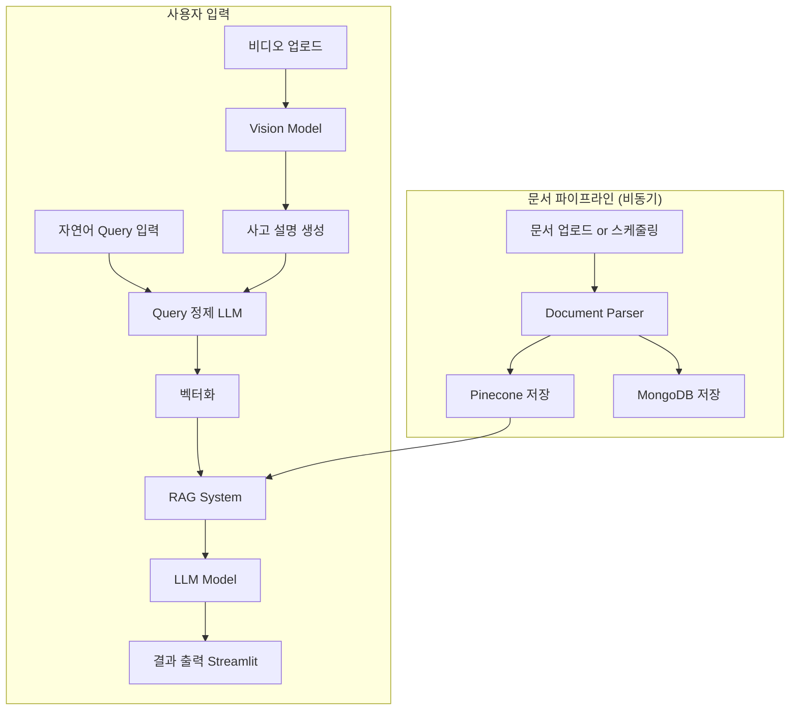
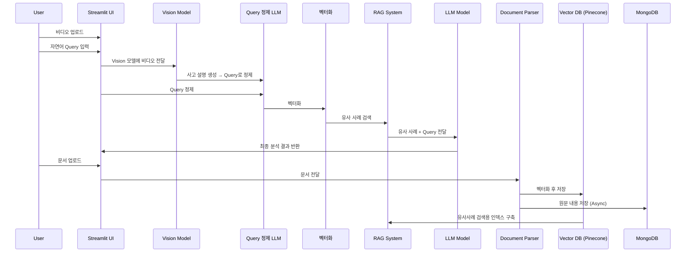

# test_legent

## streamlit 실행
streamlit run app/app.py

## 전체 시스템 파이프라인

```mermaid
graph TD
    subgraph "사용자 입력"
        U1[비디오 업로드] --> V1[Vision Model]
        V1 --> Q0[사고 설명 생성]

        U2[자연어 Query 입력] --> Q2

        Q0 --> Q2[Query 정제 LLM]
        


        Q2 --> VEC[벡터화]
        VEC --> RAG[RAG System]
        RAG --> LLM[LLM Model]

        LLM --> OUT[결과 출력 Streamlit]
    end

    subgraph "문서 파이프라인 (비동기)"
        D1[문서 업로드 or 스케줄링]
        D1 --> D2[Document Parser]
        D2 --> VDB[Pinecone 저장]
        VDB --> RAG
        D2 --> MDB[MongoDB 저장]
    end
```

## 데이터 흐름 (확장 포함)

```mermaid
sequenceDiagram
    participant User
    participant UI as Streamlit UI
    participant VM as Vision Model
    participant QLLM as Query 정제 LLM
    participant VEC as 벡터화
    participant RAG as RAG System
    participant LLM as LLM Model
    participant DOC as Document Parser
    participant VDB as Vector DB (Pinecone)
    participant MDB as MongoDB

    %% 사용자 입력 루트
    User->>UI: 비디오 업로드
    User->>UI: 자연어 Query 입력
    UI->>VM: Vision 모델에 비디오 전달
    VM->>QLLM: 사고 설명 생성 → Query로 정제
    UI->>QLLM: Query 정제
    
    QLLM->>VEC: 벡터화
    VEC->>RAG: 유사 사례 검색
    RAG->>LLM: 유사 사례 + Query 전달
    LLM->>UI: 최종 분석 결과 반환

    %% 문서 파이프라인 (비동기)
    User->>UI: 문서 업로드
    UI->>DOC: 문서 전달
    DOC->>VDB: 벡터화 후 저장
    DOC->>MDB: 원문 내용 저장 (Async)
    VDB->>RAG: 유사사례 검색용 인덱스 구축
```

