<div id="top">

<!-- HEADER STYLE: COMPACT -->


# 26TH-CONFERENCE-LEGENT
<em>Accelerate insights.  Transform justice.</em>

<!-- BADGES -->


<em>Built with the tools and technologies:</em>


<br>


<br clear="left"/>

## Table of Contents

- [Table of Contents](#table-of-contents)
- [Overview](#overview)
- [Features](#features)
- [Project Structure](#project-structure)
    - [Project Index](#project-index)
- [Getting Started](#getting-started)
    - [Prerequisites](#prerequisites)
    - [Installation](#installation)
    - [Usage](#usage)
    - [Testing](#testing)
- [Roadmap](#roadmap)
- [Contributing](#contributing)
- [License](#license)
- [Acknowledgments](#acknowledgments)

---

## Overview


---

## Features

|      | Component       | Details                              |
| :--- | :-------------- | :----------------------------------- |
| ⚙️  | **Architecture**  | <ul><li>Modular design based on directories (e.g., `models`, `data`, `utils`)</li><li>Uses multiple libraries for different tasks (see Dependencies)</li><li>Likely uses a pipeline architecture for processing data and generating outputs</li></ul> |
| 🔌 | **Integrations**  | <ul><li>Integrates with various APIs: OpenAI, Google Cloud Text-to-Speech,  ChromaDB, Milvus, Neo4j, etc.</li><li>Uses multiple databases: MongoDB, Oracle, MySQL</li><li>Leverages cloud services (Google Cloud)</li></ul> |
| 📦 | **Dependencies**  | <ul><li>Many dependencies across various domains (NLP, databases, cloud services, audio/video processing)</li><li>See `requirements.txt` for a full list</li><li>Dependency management using `pip` is indicated</li></ul> |

---

## Project Structure

```sh
└── 26th-conference-Legent/
    ├── README.md
    ├── app
    │   └── app.py
    ├── config.py
    ├── data
    │   ├── graph
    │   └── jsons
    ├── front
    │   └── app.py
    ├── legent-463917-0e7c6442775b.json
    ├── models
    │   ├── .gitignore
    │   ├── LICENSE
    │   ├── README.md
    │   ├── __init__.py
    │   ├── graph_contexts.json
    │   ├── hypergraphrag
    │   ├── requirements.txt
    │   ├── script_construct.py
    │   ├── script_query.py
    │   └── video
    ├── output
    │   ├── final_video_20250625_220626.mp4
    │   ├── final_video_20250625_234630.mp4
    │   ├── final_video_20250626_110138.mp4
    │   └── final_video_20250626_122001.mp4
    ├── preprocessing
    │   ├── document_preprocessing.py
    │   ├── testing
    │   ├── utils
    │   └── zzam_tong
    ├── requirements.txt
    ├── tts_output
    └── utils
        ├── __init__.py
        ├── accident_video_analyzer.py
        └── file_handler.py
```

### Project Index

<details open>
	<summary><b><code>26TH-CONFERENCE-LEGENT/</code></b></summary>
	<!-- __root__ Submodule -->
	<details>
		<summary><b>__root__</b></summary>
		<blockquote>
			<div class='directory-path' style='padding: 8px 0; color: #666;'>
				<code><b>⦿ __root__</b></code>
			<table style='width: 100%; border-collapse: collapse;'>
			<thead>
				<tr style='background-color: #f8f9fa;'>
					<th style='width: 30%; text-align: left; padding: 8px;'>File Name</th>
					<th style='text-align: left; padding: 8px;'>Summary</th>
				</tr>
			</thead>
				<tr style='border-bottom: 1px solid #eee;'>
					<td style='padding: 8px;'><b><a href='https://github.com/YBIGTA/26th-conference-Legent/blob/master/legent-463917-0e7c6442775b.json'>legent-463917-0e7c6442775b.json</a></b></td>
					<td style='padding: 8px;'>- The JSON file stores Google Cloud service account credentials<br>- It provides authentication information, including a private key, for a service account named legent-user within the legent-463917 Google Cloud project<br>- These credentials enable secure access to Google Cloud Platform services on behalf of the application using this file<br>- The files role is essential for secure and authorized interaction with Google Cloud resources.</td>
				</tr>
				<tr style='border-bottom: 1px solid #eee;'>
					<td style='padding: 8px;'><b><a href='https://github.com/YBIGTA/26th-conference-Legent/blob/master/requirements.txt'>requirements.txt</a></b></td>
					<td style='padding: 8px;'>- Requirements.txt specifies all project dependencies<br>- It encompasses core libraries for web application development, large language model interaction, data science, database management, media processing, natural language processing, and various utility functions<br>- The comprehensive list ensures the projects functionality across diverse modules.</td>
				</tr>
				<tr style='border-bottom: 1px solid #eee;'>
					<td style='padding: 8px;'><b><a href='https://github.com/YBIGTA/26th-conference-Legent/blob/master/config.py'>config.py</a></b></td>
					<td style='padding: 8px;'>- Config.py` centralizes the applications API keys<br>- It securely loads sensitive credentials, namely OpenAI and Upstage API keys, from an environment file (.env), making them readily accessible to other project modules without hardcoding sensitive information directly into the source code<br>- This promotes secure configuration management and improves the applications portability.</td>
				</tr>
			</table>
		</blockquote>
	</details>
	<!-- front Submodule -->
	<details>
		<summary><b>front</b></summary>
		<blockquote>
			<div class='directory-path' style='padding: 8px 0; color: #666;'>
				<code><b>⦿ front</b></code>
			<table style='width: 100%; border-collapse: collapse;'>
			<thead>
				<tr style='background-color: #f8f9fa;'>
					<th style='width: 30%; text-align: left; padding: 8px;'>File Name</th>
					<th style='text-align: left; padding: 8px;'>Summary</th>
				</tr>
			</thead>
				<tr style='border-bottom: 1px solid #eee;'>
					<td style='padding: 8px;'><b><a href='https://github.com/YBIGTA/26th-conference-Legent/blob/master/front/app.py'>app.py</a></b></td>
					<td style='padding: 8px;'>- The <code>front/app.py</code> file serves as the main entry point for the user interface of the accident video analysis application<br>- It orchestrates the flow of video processing, from upload and analysis to report generation, leveraging other modules within the project (indicated by imports like <code>utils</code> and <code>models</code>) to handle individual tasks such as file handling, video analysis, script generation, and text-to-speech conversion<br>- Essentially, it glues together the backend processing components to provide a user-friendly experience.</td>
				</tr>
			</table>
		</blockquote>
	</details>
	<!-- app Submodule -->
	<details>
		<summary><b>app</b></summary>
		<blockquote>
			<div class='directory-path' style='padding: 8px 0; color: #666;'>
				<code><b>⦿ app</b></code>
			<table style='width: 100%; border-collapse: collapse;'>
			<thead>
				<tr style='background-color: #f8f9fa;'>
					<th style='width: 30%; text-align: left; padding: 8px;'>File Name</th>
					<th style='text-align: left; padding: 8px;'>Summary</th>
				</tr>
			</thead>
				<tr style='border-bottom: 1px solid #eee;'>
					<td style='padding: 8px;'><b><a href='https://github.com/YBIGTA/26th-conference-Legent/blob/master/app/app.py'>app.py</a></b></td>
					<td style='padding: 8px;'>- The <code>app.py</code> script constitutes the Streamlit applications main interface<br>- It provides a user-friendly web application for uploading traffic accident videos, optionally adding descriptive text<br>- The application processes videos using AI, generating analysis reports and, if selected, producing a stylized video summary<br>- The application manages user interaction, data flow, and integrates various modules for video processing and analysis.</td>
				</tr>
			</table>
		</blockquote>
	</details>
	<!-- tts_output Submodule -->
	<details>
		<summary><b>tts_output</b></summary>
		<blockquote>
			<div class='directory-path' style='padding: 8px 0; color: #666;'>
				<code><b>⦿ tts_output</b></code>
			<table style='width: 100%; border-collapse: collapse;'>
			<thead>
				<tr style='background-color: #f8f9fa;'>
					<th style='width: 30%; text-align: left; padding: 8px;'>File Name</th>
					<th style='text-align: left; padding: 8px;'>Summary</th>
				</tr>
			</thead>
				<tr style='border-bottom: 1px solid #eee;'>
					<td style='padding: 8px;'><b><a href='https://github.com/YBIGTA/26th-conference-Legent/blob/master/tts_output/tts_manifest.json'>tts_manifest.json</a></b></td>
					<td style='padding: 8px;'>- The <code>tts_manifest.json</code> file catalogs text-to-speech (TTS) output<br>- It records metadata for generated audio files, including scene identification, file paths, durations, and corresponding narration scripts<br>- This manifest facilitates the management and retrieval of synthesized audio within the larger project, linking audio to its source text and providing essential timing information<br>- The files timestamp indicates generation details.</td>
				</tr>
			</table>
		</blockquote>
	</details>
	<!-- preprocessing Submodule -->
	<details>
		<summary><b>preprocessing</b></summary>
		<blockquote>
			<div class='directory-path' style='padding: 8px 0; color: #666;'>
				<code><b>⦿ preprocessing</b></code>
			<table style='width: 100%; border-collapse: collapse;'>
			<thead>
				<tr style='background-color: #f8f9fa;'>
					<th style='width: 30%; text-align: left; padding: 8px;'>File Name</th>
					<th style='text-align: left; padding: 8px;'>Summary</th>
				</tr>
			</thead>
				<tr style='border-bottom: 1px solid #eee;'>
					<td style='padding: 8px;'><b><a href='https://github.com/YBIGTA/26th-conference-Legent/blob/master/preprocessing/document_preprocessing.py'>document_preprocessing.py</a></b></td>
					<td style='padding: 8px;'>- PDF conversion to text, schema extraction to identify accident cases, and data structuring into JSON format<br>- The script processes a PDF, generating structured JSON data suitable for downstream analysis within the larger project.</td>
				</tr>
			</table>
			<!-- zzam_tong Submodule -->
			<details>
				<summary><b>zzam_tong</b></summary>
				<blockquote>
					<div class='directory-path' style='padding: 8px 0; color: #666;'>
						<code><b>⦿ preprocessing.zzam_tong</b></code>
					<table style='width: 100%; border-collapse: collapse;'>
					<thead>
						<tr style='background-color: #f8f9fa;'>
							<th style='width: 30%; text-align: left; padding: 8px;'>File Name</th>
							<th style='text-align: left; padding: 8px;'>Summary</th>
						</tr>
					</thead>
						<tr style='border-bottom: 1px solid #eee;'>
							<td style='padding: 8px;'><b><a href='https://github.com/YBIGTA/26th-conference-Legent/blob/master/preprocessing/zzam_tong/test_page.py'>test_page.py</a></b></td>
							<td style='padding: 8px;'>- The script processes a JSON file containing web page data, filtering and extracting specific page content (pages 71-72)<br>- It uses BeautifulSoup to parse HTML, retaining relevant fields like category and HTML content<br>- The processed data is then saved into separate JSON files, one for each target page, within the data directory<br>- This contributes to the projects data preprocessing stage.</td>
						</tr>
						<tr style='border-bottom: 1px solid #eee;'>
							<td style='padding: 8px;'><b><a href='https://github.com/YBIGTA/26th-conference-Legent/blob/master/preprocessing/zzam_tong/IE_negligence_ratio.py'>IE_negligence_ratio.py</a></b></td>
							<td style='padding: 8px;'>- The <code>IE_negligence_ratio.py</code> script processes a PDF document to extract information using the Upstage AI API<br>- It first generates an extraction schema from the PDF, then uses that schema to extract structured data<br>- The extracted information is saved as a JSON file, enabling downstream analysis or integration within a larger data processing pipeline<br>- The script leverages base64 encoding for efficient data handling.</td>
						</tr>
						<tr style='border-bottom: 1px solid #eee;'>
							<td style='padding: 8px;'><b><a href='https://github.com/YBIGTA/26th-conference-Legent/blob/master/preprocessing/zzam_tong/test.py'>test.py</a></b></td>
							<td style='padding: 8px;'>- The <code>test.py</code> script within the <code>preprocessing/zzam_tong</code> directory performs image-based information extraction<br>- It encodes a sample image as a base64 string and sends it to the Upstage AI API for processing<br>- The API, using a defined JSON schema, extracts specific data (in this case, the bank name) from the image and returns the result, demonstrating a component of the larger projects data preprocessing pipeline.</td>
						</tr>
						<tr style='border-bottom: 1px solid #eee;'>
							<td style='padding: 8px;'><b><a href='https://github.com/YBIGTA/26th-conference-Legent/blob/master/preprocessing/zzam_tong/DP_title.py'>DP_title.py</a></b></td>
							<td style='padding: 8px;'>- DP_title.py extracts text from a PDF document using the Upstage AI API<br>- It sends the PDF to the API for OCR processing, specifically targeting table extraction<br>- The script then cleans and concatenates the extracted text, saving the result to a new text file within the data directory<br>- This function contributes to the preprocessing stage, preparing data for downstream tasks in the larger project pipeline.</td>
						</tr>
					</table>
				</blockquote>
			</details>
			<!-- utils Submodule -->
			<details>
				<summary><b>utils</b></summary>
				<blockquote>
					<div class='directory-path' style='padding: 8px 0; color: #666;'>
						<code><b>⦿ preprocessing.utils</b></code>
					<table style='width: 100%; border-collapse: collapse;'>
					<thead>
						<tr style='background-color: #f8f9fa;'>
							<th style='width: 30%; text-align: left; padding: 8px;'>File Name</th>
							<th style='text-align: left; padding: 8px;'>Summary</th>
						</tr>
					</thead>
						<tr style='border-bottom: 1px solid #eee;'>
							<td style='padding: 8px;'><b><a href='https://github.com/YBIGTA/26th-conference-Legent/blob/master/preprocessing/utils/document_schema.py'>document_schema.py</a></b></td>
							<td style='padding: 8px;'>- The script processes pre-merged text blocks from a JSON file, extracting information according to a predefined JSON schema<br>- It uses an external API to structure the extracted data, creating a structured JSON output containing accident case details<br>- The structured data is then saved to a new JSON file, enhancing data organization within the negligence ratio analysis pipeline.</td>
						</tr>
						<tr style='border-bottom: 1px solid #eee;'>
							<td style='padding: 8px;'><b><a href='https://github.com/YBIGTA/26th-conference-Legent/blob/master/preprocessing/utils/DP_negligence_ratio.py'>DP_negligence_ratio.py</a></b></td>
							<td style='padding: 8px;'>- The <code>DP_negligence_ratio.py</code> script processes PDF files containing negligence ratios<br>- It leverages the Upstage API for OCR and document parsing, converting the PDF into structured HTML and cleaned text formats<br>- Output is saved as JSON files, facilitating subsequent data analysis within the larger projects data preprocessing pipeline<br>- The script efficiently handles multi-page PDFs by merging and cleaning text from pairs of pages.</td>
						</tr>
						<tr style='border-bottom: 1px solid #eee;'>
							<td style='padding: 8px;'><b><a href='https://github.com/YBIGTA/26th-conference-Legent/blob/master/preprocessing/utils/document_to_json.py'>document_to_json.py</a></b></td>
							<td style='padding: 8px;'>- The <code>document_to_json.py</code> script processes JSON files containing accident case data<br>- It parses the response field of each record into a valid JSON structure, adding a parsed_response field while preserving the original data<br>- Records failing parsing are saved for manual review<br>- The script outputs a new JSON file with the parsed data, enhancing data quality for downstream analysis within the larger negligence ratio project.</td>
						</tr>
					</table>
				</blockquote>
			</details>
		</blockquote>
	</details>
	<!-- models Submodule -->
	<details>
		<summary><b>models</b></summary>
		<blockquote>
			<div class='directory-path' style='padding: 8px 0; color: #666;'>
				<code><b>⦿ models</b></code>
			<table style='width: 100%; border-collapse: collapse;'>
			<thead>
				<tr style='background-color: #f8f9fa;'>
					<th style='width: 30%; text-align: left; padding: 8px;'>File Name</th>
					<th style='text-align: left; padding: 8px;'>Summary</th>
				</tr>
			</thead>
				<tr style='border-bottom: 1px solid #eee;'>
					<td style='padding: 8px;'><b><a href='https://github.com/YBIGTA/26th-conference-Legent/blob/master/models/script_query.py'>script_query.py</a></b></td>
					<td style='padding: 8px;'>- The <code>script_query.py</code> module facilitates accident report analysis<br>- It leverages a HyperGraphRAG instance to process accident data from a JSON file, augmented by a user-defined query<br>- The module retrieves data, constructs a query string, and returns analysis results<br>- This functionality integrates into a larger system for traffic accident classification and liability assessment.</td>
				</tr>
				<tr style='border-bottom: 1px solid #eee;'>
					<td style='padding: 8px;'><b><a href='https://github.com/YBIGTA/26th-conference-Legent/blob/master/models/script_construct.py'>script_construct.py</a></b></td>
					<td style='padding: 8px;'>- Script_construct.py<code> populates a knowledge graph within the larger project<br>- It leverages the </code>HyperGraphRAG<code> library to ingest context data from </code>graph_contexts.json<code>, creating a persistent knowledge base residing in the </code>data/graph` directory<br>- This structured data is subsequently used by other project components for question answering or similar tasks.</td>
				</tr>
				<tr style='border-bottom: 1px solid #eee;'>
					<td style='padding: 8px;'><b><a href='https://github.com/YBIGTA/26th-conference-Legent/blob/master/models/requirements.txt'>requirements.txt</a></b></td>
					<td style='padding: 8px;'>- Requirements.txt` specifies the projects external library dependencies<br>- It supports various functionalities including machine learning (PyTorch, transformers), large language models (tiktoken, openai, llama), database interaction (multiple drivers), graph analysis (graspologic, networkx), and vector databases (hnswlib, pymilvus, nano-vectordb)<br>- These dependencies enable the broader applications core operations and integrations.</td>
				</tr>
				<tr style='border-bottom: 1px solid #eee;'>
					<td style='padding: 8px;'><b><a href='https://github.com/YBIGTA/26th-conference-Legent/blob/master/models/graph_contexts.json'>graph_contexts.json</a></b></td>
					<td style='padding: 8px;'>- The <code>graph_contexts.json</code> file stores guideline text for managing elevated blood pressure and hypertension<br>- It forms part of a larger projects knowledge base, providing readily accessible clinical information<br>- This data supports the projects goal of delivering evidence-based recommendations for healthcare professionals, facilitating improved patient care<br>- The content includes updated guidelines, definitions, risk assessments, and recommendations for treatment.</td>
				</tr>
				<tr style='border-bottom: 1px solid #eee;'>
					<td style='padding: 8px;'><b><a href='https://github.com/YBIGTA/26th-conference-Legent/blob/master/models/LICENSE'>LICENSE</a></b></td>
					<td style='padding: 8px;'>- The LICENSE file specifies the MIT open-source license governing the projects code<br>- It grants users broad permissions to use, modify, and distribute the software, disclaiming any liability for its use<br>- This ensures legal clarity and facilitates collaboration within the broader software community<br>- The license is located within the <code>models</code> directory, suggesting its relevance to the projects core model components.</td>
				</tr>
			</table>
			<!-- video Submodule -->
			<details>
				<summary><b>video</b></summary>
				<blockquote>
					<div class='directory-path' style='padding: 8px 0; color: #666;'>
						<code><b>⦿ models.video</b></code>
					<table style='width: 100%; border-collapse: collapse;'>
					<thead>
						<tr style='background-color: #f8f9fa;'>
							<th style='width: 30%; text-align: left; padding: 8px;'>File Name</th>
							<th style='text-align: left; padding: 8px;'>Summary</th>
						</tr>
					</thead>
						<tr style='border-bottom: 1px solid #eee;'>
							<td style='padding: 8px;'><b><a href='https://github.com/YBIGTA/26th-conference-Legent/blob/master/models/video/phase3_script.py'>phase3_script.py</a></b></td>
							<td style='padding: 8px;'>- The <code>phase3_script.py</code> file within the <code>models/video</code> directory uses Googles Gemini API (via the <code>google.generativeai</code> library) to estimate the duration of text-to-speech (TTS) output in Korean<br>- This functionality likely contributes to a larger video production or processing pipeline, enabling more accurate timing and scheduling within the overall video creation process<br>- The improved accuracy suggests this script is a later iteration, refining an existing TTS duration estimation component.</td>
						</tr>
						<tr style='border-bottom: 1px solid #eee;'>
							<td style='padding: 8px;'><b><a href='https://github.com/YBIGTA/26th-conference-Legent/blob/master/models/video/phase6_render.py'>phase6_render.py</a></b></td>
							<td style='padding: 8px;'>- The <code>phase6_render.py</code> file is responsible for the final video rendering stage within a larger video processing pipeline<br>- It takes a processed timeline JSON file (presumably generated by a previous processing phase) and the path to the source video as input<br>- Using this information, it generates and saves the final rendered video to the specified output directory<br>- The files core function is to synthesize the video based on the instructions contained within the timeline JSON, effectively representing the culmination of the video editing process.</td>
						</tr>
						<tr style='border-bottom: 1px solid #eee;'>
							<td style='padding: 8px;'><b><a href='https://github.com/YBIGTA/26th-conference-Legent/blob/master/models/video/phase2A_timestamp.py'>phase2A_timestamp.py</a></b></td>
							<td style='padding: 8px;'>- The <code>phase2A_timestamp.py</code> module processes video analysis results<br>- Leveraging the Gemini API, it extracts timestamps of key events from a provided analysis report<br>- The output is a structured JSON containing event start and end times, along with descriptions, facilitating the creation of a chronologically ordered event log for traffic accident videos within a larger video processing pipeline.</td>
						</tr>
						<tr style='border-bottom: 1px solid #eee;'>
							<td style='padding: 8px;'><b><a href='https://github.com/YBIGTA/26th-conference-Legent/blob/master/models/video/phase4_tts.py'>phase4_tts.py</a></b></td>
							<td style='padding: 8px;'>- The <code>phase4_tts.py</code> module generates audio narration from script data using Google Cloud Text-to-Speech<br>- It processes scene-based narration, creating individual MP3 files and a manifest containing audio paths, durations, and metadata<br>- A secondary function handles single narration text input for backward compatibility<br>- The module leverages Google Cloud credentials for authentication and produces output in a specified directory.</td>
						</tr>
						<tr style='border-bottom: 1px solid #eee;'>
							<td style='padding: 8px;'><b><a href='https://github.com/YBIGTA/26th-conference-Legent/blob/master/models/video/phase5_timeline.py'>phase5_timeline.py</a></b></td>
							<td style='padding: 8px;'>- The <code>phase5_timeline.py</code> module generates a JSON timeline for video editing<br>- It leverages the Gemini API to intelligently determine optimal video segment start times based on provided script, TTS data, and video information<br>- A fallback mechanism uses even time distribution if the API is unavailable<br>- The output conforms to a predefined JSON schema, suitable for MoviePy, ensuring synchronization between video and audio.</td>
						</tr>
					</table>
				</blockquote>
			</details>
			<!-- hypergraphrag Submodule -->
			<details>
				<summary><b>hypergraphrag</b></summary>
				<blockquote>
					<div class='directory-path' style='padding: 8px 0; color: #666;'>
						<code><b>⦿ models.hypergraphrag</b></code>
					<table style='width: 100%; border-collapse: collapse;'>
					<thead>
						<tr style='background-color: #f8f9fa;'>
							<th style='width: 30%; text-align: left; padding: 8px;'>File Name</th>
							<th style='text-align: left; padding: 8px;'>Summary</th>
						</tr>
					</thead>
						<tr style='border-bottom: 1px solid #eee;'>
							<td style='padding: 8px;'><b><a href='https://github.com/YBIGTA/26th-conference-Legent/blob/master/models/hypergraphrag/utils.py'>utils.py</a></b></td>
							<td style='padding: 8px;'>- The <code>models/hypergraphrag/utils.py</code> file provides utility functions for the HypergraphRAG model<br>- It focuses on supporting tasks such as logging, encoding/decoding text (implicitly referencing an encoder defined elsewhere), handling concurrency limitations (via <code>UnlimitedSemaphore</code> and <code>concurrent_limit</code>), and data processing (handling various data formats like CSV, JSON, and XML)<br>- These utilities streamline various aspects of the models operation and are crucial for its overall functionality within the larger HypergraphRAG system.</td>
						</tr>
						<tr style='border-bottom: 1px solid #eee;'>
							<td style='padding: 8px;'><b><a href='https://github.com/YBIGTA/26th-conference-Legent/blob/master/models/hypergraphrag/base.py'>base.py</a></b></td>
							<td style='padding: 8px;'>- The <code>base.py</code> file defines base classes for various data storage components within the hypergraphrag model<br>- These classes, including vector, key-value, and graph storage, provide a consistent interface for data interaction, abstracting away specific implementation details<br>- They handle querying, upserting, and managing data, supporting different data structures and query modes.</td>
						</tr>
						<tr style='border-bottom: 1px solid #eee;'>
							<td style='padding: 8px;'><b><a href='https://github.com/YBIGTA/26th-conference-Legent/blob/master/models/hypergraphrag/hypergraphrag.py'>hypergraphrag.py</a></b></td>
							<td style='padding: 8px;'>- Embedding generation, knowledge graph querying (<code>kg_query</code>), entity extraction, and LLM interaction (using functions like <code>gpt_4o_mini_complete</code>)<br>- The file leverages different storage mechanisms (defined in <code>models/hypergraphrag/storage.py</code> such as <code>JsonKVStorage</code>, <code>NanoVectorDBStorage</code>, and <code>NetworkXStorage</code>) to manage knowledge and embeddings<br>- In essence, this file acts as the central controller for the RAG pipeline, managing data flow and coordinating the retrieval and generation processes within the larger project.</td>
						</tr>
						<tr style='border-bottom: 1px solid #eee;'>
							<td style='padding: 8px;'><b><a href='https://github.com/YBIGTA/26th-conference-Legent/blob/master/models/hypergraphrag/prompt.py'>prompt.py</a></b></td>
							<td style='padding: 8px;'>- The <code>models/hypergraphrag/prompt.py</code> file defines a set of constant strings used as prompts and delimiters within the larger HypergraphRAG model<br>- These prompts guide the entity extraction and relationship identification process, specifying formatting conventions (e.g., delimiters for tuples and records) and providing instructions for the models behavior<br>- Essentially, this file acts as a central repository for controlling the input format and instructions given to the core HypergraphRAG model during its operation.</td>
						</tr>
						<tr style='border-bottom: 1px solid #eee;'>
							<td style='padding: 8px;'><b><a href='https://github.com/YBIGTA/26th-conference-Legent/blob/master/models/hypergraphrag/operate.py'>operate.py</a></b></td>
							<td style='padding: 8px;'>- The <code>models/hypergraphrag/operate.py</code> file provides core operational functions for the HypergraphRAG model<br>- It leverages utility functions (defined within the same module) to handle tasks such as text chunking (based on token size), data cleaning, and encoding/decoding using TikToken<br>- These functions likely support the models ability to process and manage textual data efficiently for question answering or knowledge retrieval, as evidenced by the inclusion of prompt templates (<code>PROMPTS</code>) and data structures like <code>TextChunkSchema</code><br>- The code interacts with other modules (indicated by imports from <code>.base</code> and <code>.utils</code>) which manage data storage (e.g., graph, key-value, vector databases) within the broader HypergraphRAG system.</td>
						</tr>
						<tr style='border-bottom: 1px solid #eee;'>
							<td style='padding: 8px;'><b><a href='https://github.com/YBIGTA/26th-conference-Legent/blob/master/models/hypergraphrag/llm.py'>llm.py</a></b></td>
							<td style='padding: 8px;'>- The <code>llm.py</code> file within the <code>models/hypergraphrag</code> directory provides the core Large Language Model (LLM) interaction functionality for the project<br>- It acts as an abstraction layer, handling communication with various LLM providers (OpenAI, Azure OpenAI, Ollama) and managing potential errors like rate limits and connection issues<br>- This allows the rest of the application to interact with LLMs in a consistent and robust manner, irrespective of the underlying provider.</td>
						</tr>
						<tr style='border-bottom: 1px solid #eee;'>
							<td style='padding: 8px;'><b><a href='https://github.com/YBIGTA/26th-conference-Legent/blob/master/models/hypergraphrag/storage.py'>storage.py</a></b></td>
							<td style='padding: 8px;'>- Storage.py` provides data persistence for the HypergraphRAG model<br>- It offers key-value storage, vector database functionality using NanoVectorDB for embeddings, and NetworkX graph storage<br>- These components facilitate efficient data management, including node and edge manipulation, embedding storage and retrieval, and graph persistence within the larger project.</td>
						</tr>
					</table>
					<!-- kg Submodule -->
					<details>
						<summary><b>kg</b></summary>
						<blockquote>
							<div class='directory-path' style='padding: 8px 0; color: #666;'>
								<code><b>⦿ models.hypergraphrag.kg</b></code>
							<table style='width: 100%; border-collapse: collapse;'>
							<thead>
								<tr style='background-color: #f8f9fa;'>
									<th style='width: 30%; text-align: left; padding: 8px;'>File Name</th>
									<th style='text-align: left; padding: 8px;'>Summary</th>
								</tr>
							</thead>
								<tr style='border-bottom: 1px solid #eee;'>
									<td style='padding: 8px;'><b><a href='https://github.com/YBIGTA/26th-conference-Legent/blob/master/models/hypergraphrag/kg/tidb_impl.py'>tidb_impl.py</a></b></td>
									<td style='padding: 8px;'>- The <code>tidb_impl.py</code> file provides a database interface for the Hypergraph RAG system, specifically utilizing TiDB as the backend database<br>- It acts as a crucial component within the <code>models/hypergraphrag/kg/</code> module, handling data persistence and retrieval for the knowledge graph<br>- This allows the larger Hypergraph RAG system to store and access vector embeddings and key-value pairs efficiently within a TiDB database instance.</td>
								</tr>
								<tr style='border-bottom: 1px solid #eee;'>
									<td style='padding: 8px;'><b><a href='https://github.com/YBIGTA/26th-conference-Legent/blob/master/models/hypergraphrag/kg/neo4j_impl.py'>neo4j_impl.py</a></b></td>
									<td style='padding: 8px;'>- Neo4JStorage provides asynchronous interaction with a Neo4j graph database<br>- It handles node and edge creation, updates, retrieval, and existence checks<br>- The class integrates with the broader architecture by implementing the BaseGraphStorage interface, offering a persistent knowledge graph storage solution within the hypergraphrag system<br>- Node embeddings are supported but currently unimplemented.</td>
								</tr>
								<tr style='border-bottom: 1px solid #eee;'>
									<td style='padding: 8px;'><b><a href='https://github.com/YBIGTA/26th-conference-Legent/blob/master/models/hypergraphrag/kg/chroma_impl.py'>chroma_impl.py</a></b></td>
									<td style='padding: 8px;'>- ChromaVectorDBStorage provides a vector database implementation using ChromaDB within the Hypergraph RAG project<br>- It handles vector storage, upsert operations, and similarity searches, leveraging asynchronous operations for efficiency<br>- The component integrates with a configurable embedding function and offers cosine similarity-based filtering for query results<br>- Persistence is managed internally by ChromaDB.</td>
								</tr>
								<tr style='border-bottom: 1px solid #eee;'>
									<td style='padding: 8px;'><b><a href='https://github.com/YBIGTA/26th-conference-Legent/blob/master/models/hypergraphrag/kg/mongo_impl.py'>mongo_impl.py</a></b></td>
									<td style='padding: 8px;'>- MongoKVStorage provides a persistent key-value storage solution within the HyperGraphRAG project, leveraging MongoDB as its backend<br>- It facilitates efficient data access operations, including retrieval by ID, batch retrieval, filtering, and upserting<br>- The component integrates seamlessly with the broader systems data management strategy, ensuring reliable storage and retrieval of key-value pairs.</td>
								</tr>
								<tr style='border-bottom: 1px solid #eee;'>
									<td style='padding: 8px;'><b><a href='https://github.com/YBIGTA/26th-conference-Legent/blob/master/models/hypergraphrag/kg/milvus_impl.py'>milvus_impl.py</a></b></td>
									<td style='padding: 8px;'>- MilvusVectorDBStorge provides a vector database interface for the hypergraphrag knowledge graph<br>- It uses Milvus to store and manage embeddings, enabling efficient similarity search<br>- The module handles embedding generation, batch insertion, and querying, leveraging asynchronous operations for performance<br>- Results are formatted for seamless integration with the broader knowledge graph system.</td>
								</tr>
								<tr style='border-bottom: 1px solid #eee;'>
									<td style='padding: 8px;'><b><a href='https://github.com/YBIGTA/26th-conference-Legent/blob/master/models/hypergraphrag/kg/oracle_impl.py'>oracle_impl.py</a></b></td>
									<td style='padding: 8px;'>- The <code>oracle_impl.py</code> file provides a database interaction layer for the larger HypergraphRAG project, specifically using OracleDB as the knowledge graph storage backend<br>- It acts as an adapter, abstracting away the specifics of Oracle database communication to allow the rest of the system to interact with the knowledge graph data uniformly<br>- This module facilitates data retrieval and potentially storage within the Oracle database, contributing to the overall knowledge graph management capabilities of the HypergraphRAG system.</td>
								</tr>
							</table>
						</blockquote>
					</details>
				</blockquote>
			</details>
		</blockquote>
	</details>
	<!-- utils Submodule -->
	<details>
		<summary><b>utils</b></summary>
		<blockquote>
			<div class='directory-path' style='padding: 8px 0; color: #666;'>
				<code><b>⦿ utils</b></code>
			<table style='width: 100%; border-collapse: collapse;'>
			<thead>
				<tr style='background-color: #f8f9fa;'>
					<th style='width: 30%; text-align: left; padding: 8px;'>File Name</th>
					<th style='text-align: left; padding: 8px;'>Summary</th>
				</tr>
			</thead>
				<tr style='border-bottom: 1px solid #eee;'>
					<td style='padding: 8px;'><b><a href='https://github.com/YBIGTA/26th-conference-Legent/blob/master/utils/accident_video_analyzer.py'>accident_video_analyzer.py</a></b></td>
					<td style='padding: 8px;'>- AccidentVideoAnalyzer processes traffic accident videos to produce structured JSON reports<br>- Leveraging Google Geminis capabilities, it analyzes video content, identifying key details like involved parties, actions, and violations, according to a predefined workflow and strict guidelines<br>- The resulting JSON facilitates objective accident reconstruction and liability assessment<br>- Error handling and file management are incorporated.</td>
				</tr>
				<tr style='border-bottom: 1px solid #eee;'>
					<td style='padding: 8px;'><b><a href='https://github.com/YBIGTA/26th-conference-Legent/blob/master/utils/file_handler.py'>file_handler.py</a></b></td>
					<td style='padding: 8px;'>- File_handler.py` manages temporary video storage within the application<br>- It provides functions to save uploaded videos to temporary files, returning their paths for processing elsewhere in the system<br>- A cleanup function ensures these temporary files are deleted after use, preventing unnecessary disk space consumption<br>- This module supports the applications core video processing workflow.</td>
				</tr>
			</table>
		</blockquote>
	</details>
</details>

---

## Getting Started

### Prerequisites

This project requires the following dependencies:

- **Programming Language:** Python
- **Package Manager:** Pip

### Installation

Build 26th-conference-Legent from the source and intsall dependencies:

1. **Clone the repository:**

    ```sh
    ❯ git clone https://github.com/YBIGTA/26th-conference-Legent
    ```

2. **Navigate to the project directory:**

    ```sh
    ❯ cd 26th-conference-Legent
    ```

3. **Install the dependencies:**

<!-- SHIELDS BADGE CURRENTLY DISABLED -->
	<!-- [![pip][pip-shield]][pip-link] -->
	<!-- REFERENCE LINKS -->
	<!-- [pip-shield]: https://img.shields.io/badge/Pip-3776AB.svg?style={badge_style}&logo=pypi&logoColor=white -->
	<!-- [pip-link]: https://pypi.org/project/pip/ -->

	**Using [pip](https://pypi.org/project/pip/):**

	```sh
	❯ pip install -r requirements.txt, models/requirements.txt
	```

### Usage

Run the project with:

**Using [pip](https://pypi.org/project/pip/):**
```sh
python {entrypoint}
```

### Testing

26th-conference-legent uses the {__test_framework__} test framework. Run the test suite with:

**Using [pip](https://pypi.org/project/pip/):**
```sh
pytest
```

---

## Contributing

- **💬 [Join the Discussions](https://github.com/YBIGTA/26th-conference-Legent/discussions)**: Share your insights, provide feedback, or ask questions.
- **🐛 [Report Issues](https://github.com/YBIGTA/26th-conference-Legent/issues)**: Submit bugs found or log feature requests for the `26th-conference-Legent` project.
- **💡 [Submit Pull Requests](https://github.com/YBIGTA/26th-conference-Legent/blob/main/CONTRIBUTING.md)**: Review open PRs, and submit your own PRs.

<details closed>
<summary>Contributing Guidelines</summary>

1. **Fork the Repository**: Start by forking the project repository to your github account.
2. **Clone Locally**: Clone the forked repository to your local machine using a git client.
   ```sh
   git clone https://github.com/YBIGTA/26th-conference-Legent
   ```
3. **Create a New Branch**: Always work on a new branch, giving it a descriptive name.
   ```sh
   git checkout -b new-feature-x
   ```
4. **Make Your Changes**: Develop and test your changes locally.
5. **Commit Your Changes**: Commit with a clear message describing your updates.
   ```sh
   git commit -m 'Implemented new feature x.'
   ```
6. **Push to github**: Push the changes to your forked repository.
   ```sh
   git push origin new-feature-x
   ```
7. **Submit a Pull Request**: Create a PR against the original project repository. Clearly describe the changes and their motivations.
8. **Review**: Once your PR is reviewed and approved, it will be merged into the main branch. Congratulations on your contribution!
</details>

<details closed>

---

## License

26th-conference-legent is protected under the [LICENSE](https://choosealicense.com/licenses) License. For more details, refer to the [LICENSE](https://choosealicense.com/licenses/) file.

---

## Acknowledgments

- **Junho Kim** — Team Leader, RAG pipeline  
- **Jungmook Kang** — Prompt Engineering, Frontend  
- **Jungyang Park** — RAG Pipeline, Graph Generation  
- **Haneul Park** — Video Generation  
- **Jaeyoung Lee** — Document Parsing, Video Generation, Frontend  
- **Dogeun Lee** — Frontend

<div align="right">

[![][back-to-top]](#top)

</div>


[back-to-top]: https://img.shields.io/badge/-BACK_TO_TOP-151515?style=flat-square

## 전체 시스템 파이프라인

```mermaid
graph TD
    subgraph "사용자 입력"
        U1[비디오 업로드] --> V1[Vision Model]
        V1 --> Q0[사고 설명 생성]

        U2[자연어 Query 입력] --> Q2

        Q0 --> Q2[Query 정제 LLM]
        


        Q2 --> VEC[벡터화]
        VEC --> RAG[RAG System]
        RAG --> LLM[LLM Model]

        LLM --> OUT[결과 출력 Streamlit]
    end

    subgraph "문서 파이프라인 (비동기)"
        D1[문서 업로드 or 스케줄링]
        D1 --> D2[Document Parser]
        D2 --> VDB[Pinecone 저장]
        VDB --> RAG
        D2 --> MDB[MongoDB 저장]
    end
```



## 데이터 흐름 (확장 포함)

```mermaid
sequenceDiagram
    participant User
    participant UI as Streamlit UI
    participant VM as Vision Model
    participant QLLM as Query 정제 LLM
    participant VEC as 벡터화
    participant RAG as RAG System
    participant LLM as LLM Model
    participant DOC as Document Parser
    participant VDB as Vector DB (Pinecone)
    participant MDB as MongoDB

    %% 사용자 입력 루트
    User->>UI: 비디오 업로드
    User->>UI: 자연어 Query 입력
    UI->>VM: Vision 모델에 비디오 전달
    VM->>QLLM: 사고 설명 생성 → Query로 정제
    UI->>QLLM: Query 정제
    
    QLLM->>VEC: 벡터화
    VEC->>RAG: 유사 사례 검색
    RAG->>LLM: 유사 사례 + Query 전달
    LLM->>UI: 최종 분석 결과 반환

    %% 문서 파이프라인 (비동기)
    User->>UI: 문서 업로드
    UI->>DOC: 문서 전달
    DOC->>VDB: 벡터화 후 저장
    DOC->>MDB: 원문 내용 저장 (Async)
    VDB->>RAG: 유사사례 검색용 인덱스 구축
```



